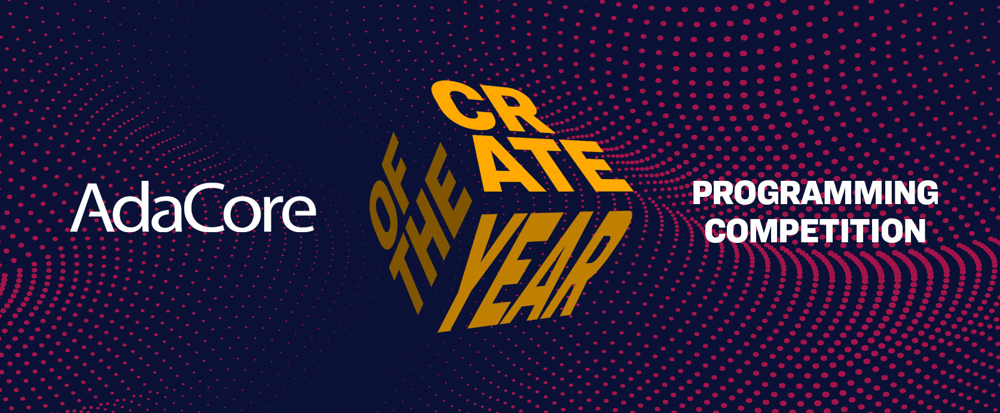

<table style="width:100%; text-align: center">
 <tr>
  <th><a href="docs/#installation" class="button"><h3>Install Alire</h3></a></th>
  <th><a href="docs/#first-steps" class="button"><h3>Getting Started</h3></a></th>
 </tr>
</table>
 

## ALIRE: Ada LIbrary REpository

A catalog of ready-to-use
[Ada](https://en.wikipedia.org/wiki/Ada_(programming_language))/[SPARK](https://en.wikipedia.org/wiki/SPARK_(programming_language))
libraries plus a command-line tool (`alr`) to obtain, build, and incorporate
them into your own projects. It aims to fulfill a similar role to Rust's
`cargo` or OCaml's `opam`.

### Design principles

`alr` is tailored to userspace, in a similar way to Python's virtualenv. A
project or workspace will contain all its dependencies.

Some projects require binary packages from the distribution (Debian/Ubuntu's
apt, msys2's pacman on Windows). In this case the user will be asked to
authorize an installation through the distribution package manager.

Properties and dependencies of projects are managed through a TOML file. This
file exists locally for working copies of projects, and the [Alire community
index](https://github.com/alire-project/alire-index) stores the files
corresponding to its projects.

The complete build environment is set up by setting the `GPR_PROJECT_PATH`
environment variable before running `gprbuild`, thus freeing the user from
concerns about installation paths. The user simply adds the used projects to
its own project GPR file with their simple name.

### Supported platforms

`Alire` requires a recent Ada 2012 compiler. In practice, this currently means
[GNAT Community](https://www.adacore.com/download) or GNAT FSF 7.2 onward. The
continuous integration checks are run against Debian stable, Ubuntu LTS,
Windows and MacOS.



